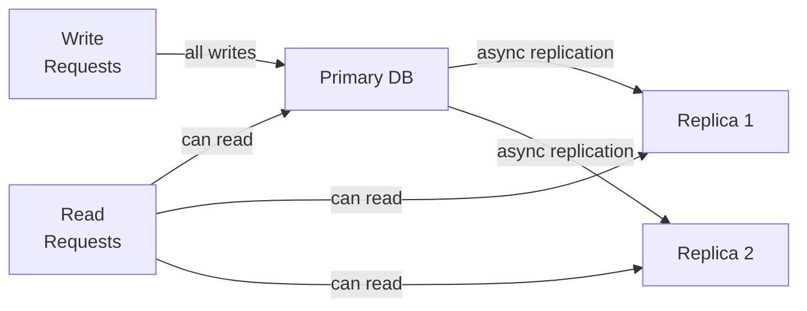
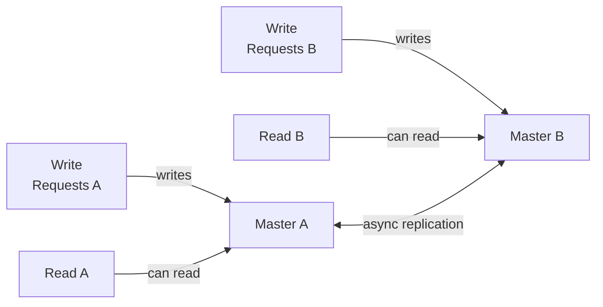
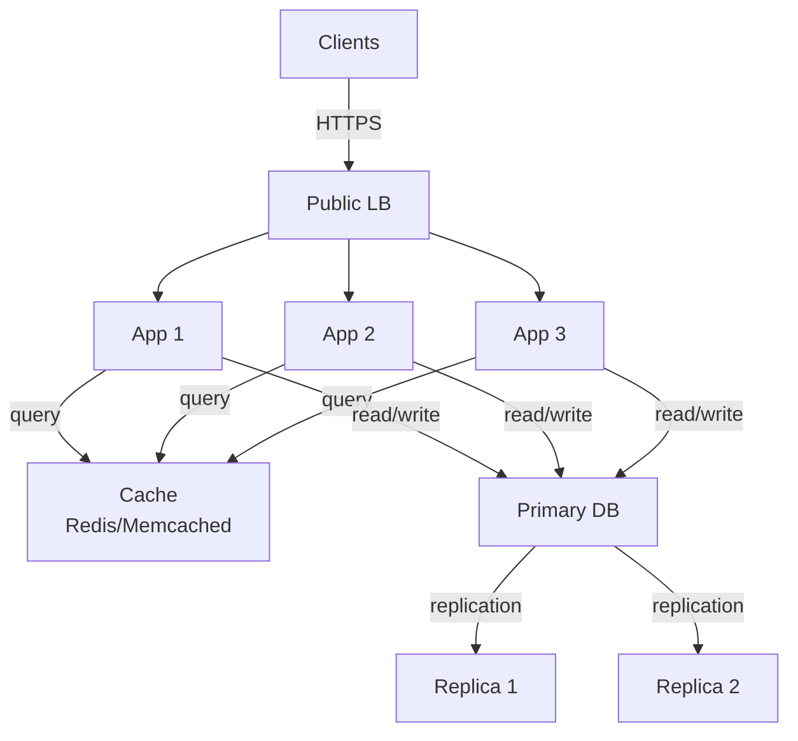
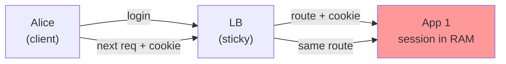
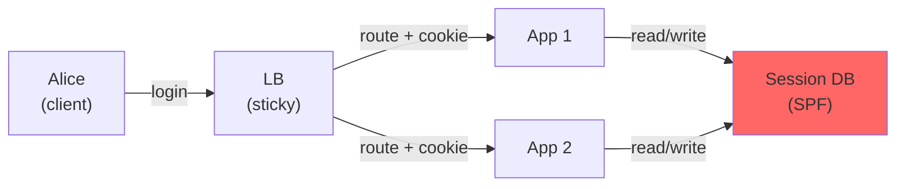
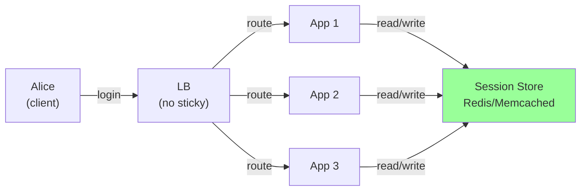
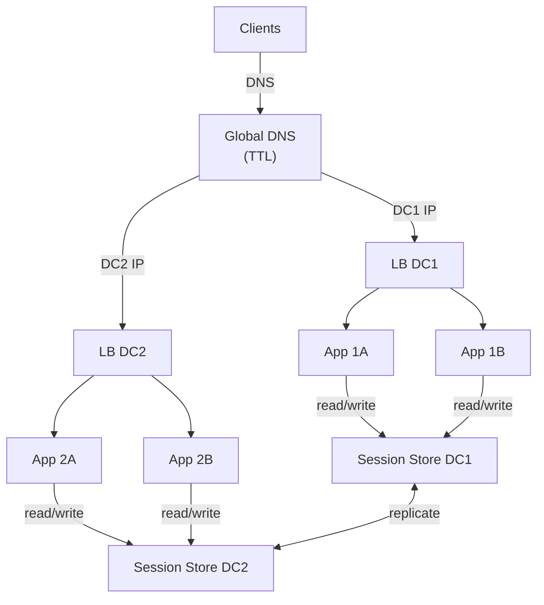

# Scalability

These notes combine the original hand-written content with short explanations, examples, and ASCII diagrams.

## Vertical scaling

"Scaling up": increasing resources (CPU, RAM, disk) of a single server.

- Limited by hardware constraints and cost.
- Modern servers have multiple CPUs and multi-core processors enabling parallelism.

Example (single node upgrade):

```
[App Server]
CPU: 4 -> 16 cores
RAM: 16GB -> 128GB
Disk: 1TB -> 8TB
```

## Horizontal scaling

"Scaling out": distributing workload across multiple servers.

- Requires mechanisms for balancing load and directing requests intelligently.
- Uses cheaper, possibly older hardware in greater quantity rather than a few expensive machines.

Example (multi-node):

```
         +---------+
Clients->|  LB     |---> [App 1]
         +---------+---> [App 2]
                     -> [App 3]
```

## Load balancing

- Critical for distributing incoming web traffic across multiple backend servers.
- **Load balancer** acts as a "black box" with a public IP that clients connect to; the load balancer routes requests to backend servers with private IPs.
- Load balancing methods:
  - **Load-based balancing:** sends requests to least busy servers.
  - **Round-robin DNS:** DNS server returns different IP addresses cyclically to distribute load.
    - Simple but can cause uneven load due to caching and lack of server load awareness.
- Backend servers must be **identical in content** for arbitrary request routing.
- Issues arise with **stateful sessions** (e.g., PHP sessions stored locally on each server):
  - Users routed to different servers may lose session state, causing login and shopping cart problems.
  - Solutions include:
    - Shared session storage on a centralized server or load balancer.
    - Using **sticky sessions** via cookies to route users consistently to the same backend server.
    - Storing session IDs in cookies with load balancer mapping for privacy and spoofing protection.

### DNS round robin, bind, and TTLs

**Round robin DNS with BIND**: a DNS server can return multiple A records for the same name, rotating the order.

Example zone snippet (conceptual):

```
fitness.example.com.  60  IN  A  203.0.113.10
fitness.example.com.  60  IN  A  203.0.113.11
fitness.example.com.  60  IN  A  203.0.113.12
```

Client resolution flow:

```
Client -> Resolver -> BIND returns A records (rotated order)
Resolver caches for TTL seconds
Client connects to first IP in answer list
```

**TTL impact**

```
Low TTL (e.g., 30-60s):
  + Faster failover and rebalancing
  - More DNS queries and higher resolver load

High TTL (e.g., 10-60m):
  + Fewer DNS queries, better cache hit rate
  - Slower failover, uneven load if one node is hot
```

**Why round robin DNS is imperfect**

```
- Resolvers cache answers, so many clients get the same IP for TTL duration
- No visibility into backend load or health
- Clients may ignore order, prefer IPv6, or stick to one IP
```

### How they differ (DNS round robin vs cookies vs shared state vs sticky sessions)

**DNS round robin** decides *which IP a client connects to before any HTTP request exists*.

```
Client -> DNS -> gets IP list -> connects to chosen IP
```

- Operates at DNS time, not request time.
- No per-request load awareness; relies on resolver caches and client behavior.
- Useful as a simple, low-cost distribution or global steering layer.

**Cookies** are just data stored on the client and sent with each HTTP request.

```
LB/App sets cookie -> Browser stores -> Browser sends cookie on next requests
```

- Cookies do not load balance by themselves.
- They are used by an LB or app to *remember* a decision (like which backend).

**Sticky sessions** use cookies to keep a client on the same backend server.

```
LB sets cookie = "backend=A" -> routes client to App A each time
```

- Affinity is enforced by the load balancer using the cookie.
- Still no shared session data; it just tries to keep you on the same node.

**Shared state (shared session storage)** moves session data out of the app servers.

```
App A/B/C -> [Session Store]
```

- Any backend can serve the request because session data lives centrally.
- Eliminates the need for sticky sessions to preserve login state.

**Short summary**

```
DNS round robin: chooses a server IP at lookup time
Cookies: client-side storage used to remember routing or session IDs
Sticky sessions: LB uses a cookie to keep a client on one backend
Shared state: session data stored centrally so any backend can serve the user
```

### Shared sessions vs sticky sessions

**Shared session storage** (recommended for scale)

```
Client -> LB -> App A/B/C -> [Session Store]
```

- Pros: stateless app servers, easy scaling, safe with retries and failover.
- Cons: extra network hop, must protect session store and scale it.
- Common stores: Redis, Memcached, database-backed sessions.

**Sticky sessions** (LB affinity)

```
Client -> LB (cookie) -> App A
Client -> LB (cookie) -> App A
```

- Pros: simple to adopt, no shared session infrastructure.
- Cons: uneven load, hard failover (if App A dies, session lost), weak for autoscaling.

**Hybrid approach**

```
Sticky sessions + shared session store
```

- Lets you preserve locality for in-memory caches while keeping a durable session source.

Stateful session problem (example):

```
Client (login) -> App A stores session locally
Client (next req) -> App B (no session) -> logged out
```

Fixes:

```
1) Shared session store
   App A/B/C -> [Session DB or Redis]

2) Sticky sessions
   LB sets cookie -> routes same client to same backend
```

## Caching

- Caching is critical for performance and scalability.
- Examples:
  - **Static HTML caching** (Craigslist approach): generates static HTML files to serve quickly but causes redundancy and maintenance complexity.
  - **MySQL query cache:** stores results of queries to speed up repeated identical queries.
  - **Memcached:** a distributed in-memory key-value store used to cache arbitrary data, reducing database load (one of the first simple, fast, and widely adopted in-memory caches for web apps).
    - **In-memory, key-value cache**: Stores data in RAM; values are retrieved by key.
    - **Not persistent**: Data is lost on restart or eviction; it is a cache, not a database.
    - **Distributed**: You can shard keys across multiple cache nodes for scale.
    - **Simple API**: get, set, delete, incr/decr; no complex queries.
    - **Eviction policy**: When full, it evicts old entries (LRU-style) to make room.
    - Best for **read-heavy** workloads: Reduces database hits and latency. (Facebook)
    - **No replication** by default: If a node fails, cached data on it is gone.
    - **Client-side hashing**: The app decides which server a key goes to.

Cache-aside pattern (common):

```
Request -> App -> Cache
                 | hit: return
                 | miss: fetch DB -> store in cache -> return
```

Example: Cache top 100 popular exercise query results for 15 minutes to reduce embedding search load.

## DB Replication

### Storage Technologies and Data Redundancy

Shared state improves performance between servers, but then we have a new problem: redundancy.

- Hard drives vary by interface and speed:
  - **Parallel ATA (IDE)** - older standard.
  - **SATA** - current standard for desktops and laptops.
  - **SAS (Serial Attached SCSI)** - faster and more expensive, common in servers.
  - **SSD (Solid State Drives)** - faster but smaller and pricier than mechanical drives.
- **RAID (Redundant Array of Independent Disks)** used to improve performance and reliability: avoids data loss with high probability.
  - RAID 0: striping for speed, no redundancy.
  - RAID 1: mirroring for redundancy.
  - RAID 5 & 6: parity-based redundancy with better storage efficiency and fault tolerance.
  - RAID 10: combines striping and mirroring.
  - Notes CCA

RAID quick diagrams:

```
RAID 0 (striping):
Disk1: A1 A2 A3
Disk2: B1 B2 B3

RAID 1 (mirroring):
Disk1: A B C
Disk2: A B C

RAID 5 (parity):
Disk1: A  B  P
Disk2: C  P  D
Disk3: P  E  F

RAID 10 (mirror + stripe):
[Disk1] A B C  <-> [Disk2] A B C
[Disk3] D E F  <-> [Disk4] D E F
Striped across pairs
```

- Shared storage solutions (e.g., Fibre Channel, NFS) can centralize session or file data but risk becoming single points of failure.
- Replication and redundancy strategies are essential to **avoid single points of failure**.

## DB partitioning (Scaling and replication)

- Databases like **MySQL** support multiple storage engines (InnoDB supports transactions; MyISAM does not).
- **Replication** involves a **master database** and one or more **slave databases**:
  - Slaves replicate all data from the master.
  - Improves read scalability by redirecting read queries to slaves.
  - Provides redundancy for failover.
- For high availability, **master-master replication** allows writes on multiple masters, enabling load balancing and failover.
- Challenges:
  - Single master remains a potential failure point in simple replication.
  - Code complexity increases when handling multiple masters or failovers.

### Option 1: Single Master (Primary-Replica)

**ASCII diagram**

```
Writes -> [Primary DB]
           |  \
           |   \__ async replication __> [Replica 1]
           |                         \> [Replica 2]
Reads  -> [Primary or Replicas]
```

**Mermaid diagram**



**Pros**
- Simple write path and conflict-free writes.
- Easy to reason about data correctness.
- Read scaling by adding replicas.

**Cons**
- Primary is a single point of failure for writes.
- Failover requires promotion and client rerouting.
- Replication lag can cause stale reads.

### Option 2: Dual Masters (Master-Master)

**ASCII diagram**

```
Writes -> [Master A] <----> [Master B] <- Writes
            ^    \          /    ^
            |     \__ replication  |
            |                      |
        Reads A                Reads B
```

**Mermaid diagram**



**Pros**
- Writes can continue if one master fails (higher availability).
- Can split write traffic geographically.

**Cons**
- Conflict resolution needed (same record updated in both places).
- More complex operationally and in application logic.
- Risk of divergence during network partitions.

### Option 3: Multi-Tier Architecture (with Replication)

**ASCII diagram**

```
Clients
  | HTTPS
  v
[Public LB]
  |
  v
[App Servers] --(cache)--> [Cache]
  |
  v
[Primary DB] ---> [Replica 1]
              \-> [Replica 2]
```

**Mermaid diagram**



**Pros**
- Clear separation of responsibilities (LB, app, cache, DB).
- Scales independently per tier.
- Easier to add redundancy at each layer.

**Cons**
- More moving parts and network hops.
- Requires stronger observability and monitoring.
- More complex debugging across tiers.

### Quick Comparison

```
Single master: simplest, strong consistency, weakest write availability.
Dual masters: higher write availability, highest complexity and conflict risk.
Multi-tier: scalable and resilient, but more operational overhead.
```

## Multi-tier architecture and network topology

- Typical scalable web architecture involves multiple tiers:
  - Load balancers.
  - Web servers (application servers).
  - Database servers (with replication).
- Network design must address redundancy:
  - Multiple load balancers (active-active or active-passive).
  - Multiple network switches to avoid single points of failure.
  - Cross-connections to prevent isolated failure.
- Global scale involves multiple **data centers** or **availability zones** (e.g., Amazon EC2 regions).
  - DNS-based global load balancing directs users to the nearest or healthiest data center.
  - Cross-data center session sharing is challenging and often avoided due to latency and complexity.

Multi-tier flow (example):

```
Clients
  | HTTPS
  v
[Global DNS] -> [Regional LB] -> [API servers] -> [Vector DB]
                                           -> [Metadata DB]
                                           -> [Cache]
```

## Security and firewalling

- Internet-facing firewalls should allow only necessary ports:
  - **TCP 80 (HTTP)** and **TCP 443 (HTTPS)** for web traffic.
  - **TCP 22 (SSH)** for secure server access or VPN ports for remote administration.
- Inside data centers, traffic between load balancers, web servers, and databases can be less strictly encrypted but should be isolated.
- SSL termination often done at load balancer to offload encryption overhead from web servers.
- Principle of least privilege applies: only open necessary ports to minimize attack surface.

Example rules:

```
Allow: 80/443 to LB
Allow: 22 only via VPN or bastion
Block: direct DB access from public internet
```

## Load Balancing and Sticky Sessions: Decision-Making

Based on hand-drawn diagrams, here's the decision-making process for different architectural choices:

### Problem: How to handle sticky sessions?

#### Option 1: Only LB, no shared state

**Decision**
- Keep session data local to each app server.
- Use LB with sticky sessions (cookies) to route the same client to the same server.

**Mermaid diagram**



**Reasoning**
- Alice logs in → routed to App 1, session stored in App 1's memory.
- Alice makes next request → LB sees cookie, routes to App 1 again.
- Works fine as long as the cookie is honored.

**Problem**
- If Alice loses the cookie (clears browser, new device, etc.), she cannot get back to App 1.
- No way to recover the session if the app server dies.

**Verdict**: Simple but fragile.

#### Option 2: Persistent database + single point of failure

**Decision**
- Store sessions in a persistent database (not just app memory).
- Still use sticky sessions to avoid extra DB queries.

**Mermaid diagram**



**Reasoning**
- Survives app server restarts.
- If Alice loses cookies, you can look up by user ID in the DB.

**Problem**
- The session database becomes a single point of failure (SPF).
- Every app reads/writes sessions to one DB → bottleneck and availability risk.

**Verdict**: Better than in-memory only, but introduces a critical dependency.

#### Option 3: Solution with switch (shared cache/session store)

**Decision**
- Add a centralized session store (Redis, Memcached, or a session database).
- All app servers query it; no longer tied to sticky sessions.

**Mermaid diagram**



**Reasoning**
- Alice logs in → session stored in central store.
- Next request → routed to any app server (App 1, 2, or 3).
- App server looks up session in the store.
- Works even if Alice switches devices or the cookie is lost.

**Benefit**: Decouples session availability from individual app servers.

### Multi-Data Center Scalability

#### Question: How to handle LB in 2 data centers?

**One step further: Always zero in DC** (availability zones)

**Decision**
- Run multiple load balancers across data centers (active-active or active-passive).
- Use DNS at the top level to steer traffic to the nearest or healthiest DC.

**Mermaid diagram**



**LB at DNS level**
- DNS can return different IP addresses pointing to different data centers.
- Short TTL allows failover if one DC goes down.

**Challenge**
- Session store must be replicated across DCs (adds complexity).
- Cross-DC replication has higher latency.

### Summary: Decision Tree

```
1. Sticky sessions only?
   → Simple, but sessions lost on cookie loss or server failure.

2. Sticky sessions + persistent DB?
   → Better durability, but DB becomes a bottleneck and SPF.

3. Shared session store (Redis/cache)?
   → Decoupled, scalable, works across any app server.
   → Add sticky sessions on top for performance.

4. Multi-DC?
   → Use DNS-level LB routing.
   → Replicate session store across DCs.
   → Increases complexity; weigh against availability gains.
```
